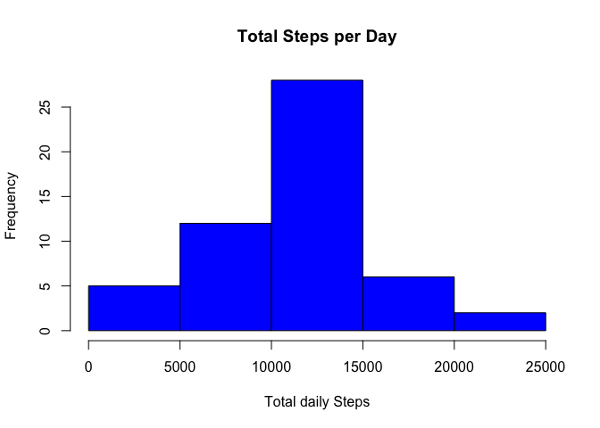
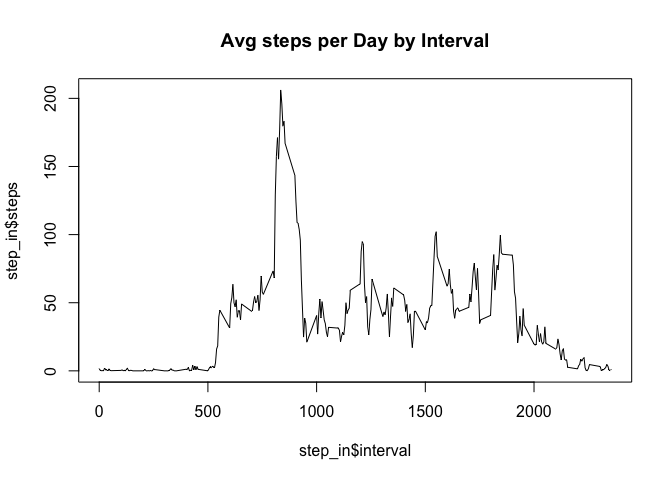
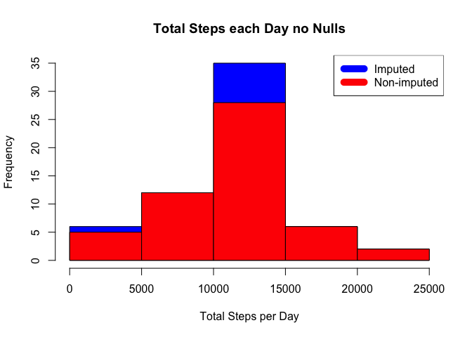
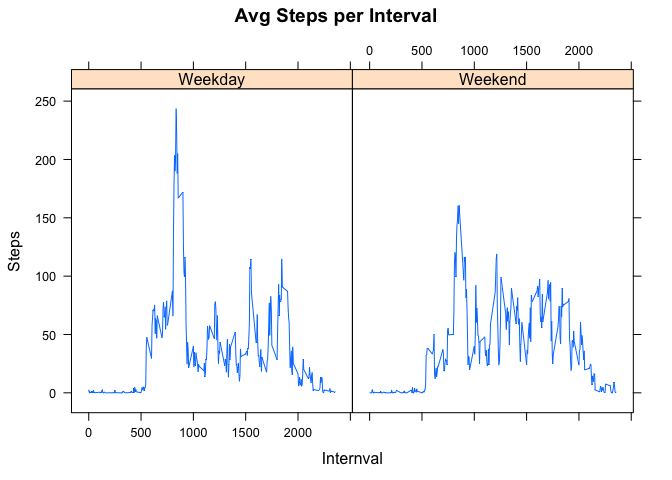

# Reproducible Research: Peer Assessment 1


## Loading and preprocessing the data

First steps is to load in a CSV file as shown below:

```r
library("httr")
csvfile = "/Users/ultimav666/Github/RepData_PeerAssessment1/activity.csv"
workdata <- read.csv(csvfile)
```
## What is mean total number of steps taken per day?
In this step, I use the aggregate function to sum steps by date. I did not need to use the Date() function in this case.
Then from there, I used the hist() function to produce the needed historgram.

```r
dailysteps <- aggregate(steps ~ date, data = workdata, sum)
#library("ggplot2")
hist(dailysteps$steps, main = "Total Steps per Day", xlab = "Total daily Steps", col = "blue")
```

 

```r
meansteps <- mean(dailysteps$steps)
meansteps
```

```
## [1] 10766.19
```

```r
mediansteps <- median(dailysteps$steps)
mediansteps
```

```
## [1] 10765
```

## What is the average daily activity pattern?

Similiar to before, I used the aggregate function but instead of "sum" I used "mean" and instead of by date, the factor
that is used to sum is "interval" as can be seen below. Then this is followed by using the base graphic device plot
function to produce the rest. I used the "Which.max" function

```r
step_in <- aggregate(steps ~ interval, data = workdata, mean)
plot(step_in$interval, step_in$steps, type = "l", main = "Avg steps per Day by Interval")
```

 

```r
max_int <- step_in[which.max(step_in$steps),1]
max_int
```

```
## [1] 835
```
## Imputing missing values
For missing values, I utilized the complete.cases() function, and from there transformed the results if it was null to a value in the last 
data.frame that had a value for that same internval. Also inserted "0" for 2012-10-01 date. Then below I cook the mean and median of the analysis
performed. Then I compared the difference between the two different types of analysis with the respective graphs.

```r
nullcount <- sum(!complete.cases(workdata))
nullreplace <- transform(workdata, steps = ifelse(is.na(workdata$steps),step_in$steps[match(workdata$interval,step_in$interval)],workdata$steps))
nullreplace[as.character(nullreplace$date) == "2012-10-01", 1] <- 0

stepsbydaywnonull <- aggregate(steps ~ date, data = nullreplace, sum)
hist(stepsbydaywnonull$steps, main = "Total Steps each Day no Nulls", xlab = "Total Steps per Day", col = "blue")
hist(dailysteps$steps, main = "Total Steps each Day no Nulls", col = "red", xlab = "Total Steps per Day", add = T)
legend("topright", c("Imputed", "Non-imputed"), col=c("blue", "red"), lwd=10)
```

 

```r
newmeansteps<- mean(stepsbydaywnonull$steps)
newmediansteps <- median(stepsbydaywnonull$steps)

mean.diff <- newmeansteps - meansteps
median.diff <- newmediansteps - mediansteps
mean.diff
```

```
## [1] -176.4949
```

```r
median.diff
```

```
## [1] 1.188679
```

```r
total.diff <- sum(stepsbydaywnonull$steps) - sum(dailysteps$steps)
total.diff
```

```
## [1] 75363.32
```
## Are there differences in activity patterns between weekdays and weekends?
Last but not least, I created a vector of the weekdays. I created one for weekends, but since I utilized the ifelse function, anything not in the
weekday vector would automatically become a weekend day. So I created a "dayofweek" variable based on the ifelse function and then graphed the
items with xyplot (which is found in lattice). When you use the as.factor function, it will use the names of the two levels as separaters for
the different panels in xyplot. Oh this helps!

```r
weekday <- c("Monday", "Tuedsday", "Wednesday", "Thursday", "Friday")
weekend <- c("Saturday", "Sunday")

#you can interchangeably use %in% or is.element() to determine if the result is in the weekday vector
nullreplace$dayofweek <- as.factor(ifelse(is.element(weekdays(as.Date(nullreplace$date)),weekday), "Weekday", "Weekend"))
        
steps_in.wtweek <- aggregate(steps ~ interval + dayofweek, data = nullreplace, mean)
library(lattice)
xyplot(steps_in.wtweek$steps ~ steps_in.wtweek$interval | steps_in.wtweek$dayofweek, main = "Avg Steps per Interval", xlab = "Internval", ylab = "Steps", type = "l")
```

 
